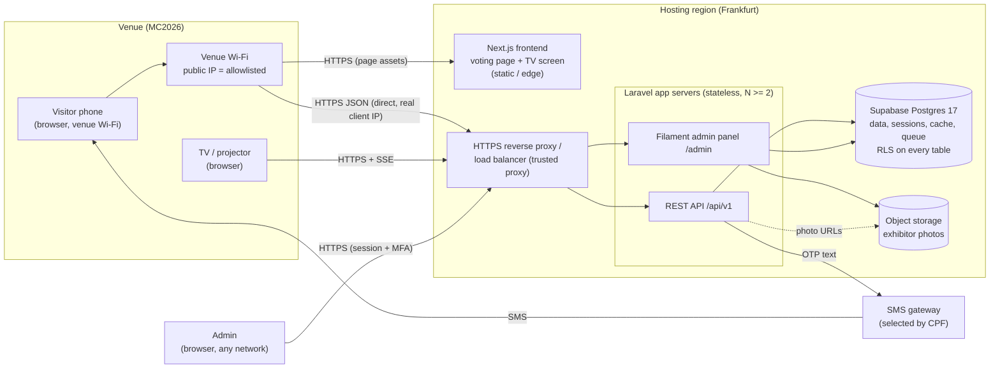
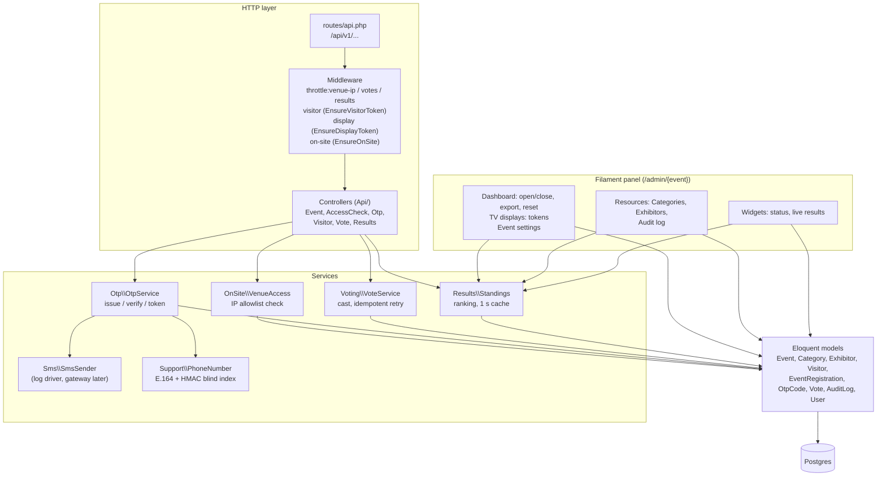
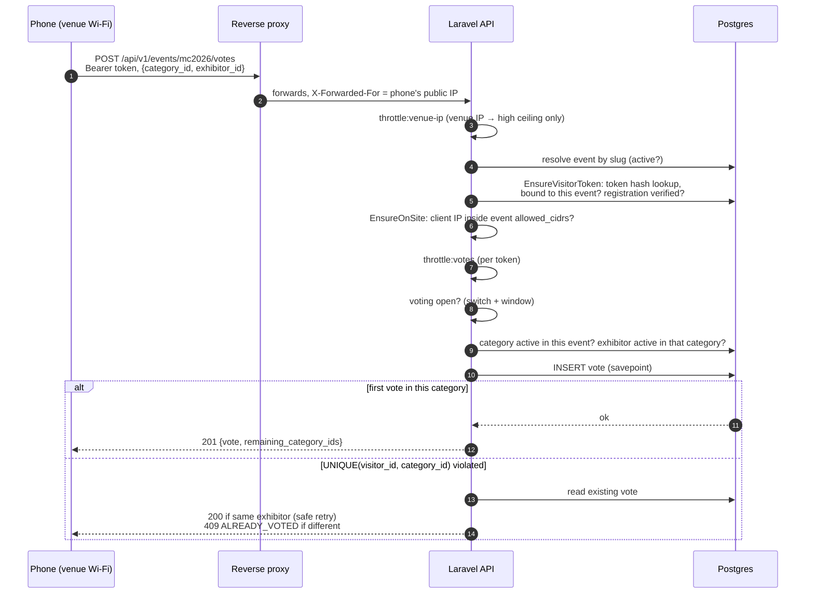

# 01 — Architecture

Digital Voting System for the Maker Collective 2026 (MC2026) community awards. Visitors vote on their own phones at the venue, a TV shows live standings, and the Makerspace team runs everything from an admin panel.

> Related: [02 ERD](02-erd.md) · [03 API contract](03-api-contract.md) · [04 Data flow](04-data-flow.md) · [05 Authentication & authorization](05-auth-and-access-control.md) · [06 Design decisions](06-design-decisions.md) · [07 Deployment](07-deployment.md) · [08 Scaling](08-scaling.md) · [09 Requirements traceability](09-requirements-traceability.md)

## 1. System at a glance

| Part | Technology | Owner | Purpose |
|---|---|---|---|
| Visitor voting page | Next.js (mobile-first) | Frontend developer | QR code → event page → name + phone → OTP → vote per category |
| TV results screen | Next.js | Frontend developer | Live leaderboard per category via Server-Sent Events |
| REST API | Laravel 13 (PHP 8.3), Sanctum tokens | Backend | Every visitor and TV operation; the only way data leaves the system |
| Admin panel | Filament 5 (Livewire 4), server-rendered | Backend | Events, categories, exhibitors, voting window, on-site rules, live results, exports, reset, TV tokens, audit log |
| Database | Supabase Postgres 17 (Frankfurt) | Backend | All data and all settings; also sessions, cache and queue tables |
| SMS | `SmsSender` interface; `log` driver today | CPF provides gateway | OTP delivery |
| Photos | Laravel filesystem disk (`public` locally, S3-compatible such as Supabase Storage in production) | Backend | Exhibitor visuals |

## 2. Design principles

1. **The server decides everything that matters.** On-site status, voting window, OTP validity, one-vote-per-category and rankings are computed server-side. The frontend only reflects them; bypassing it gains nothing.
2. **The database is the final guard.** One vote per category is a `UNIQUE (visitor_id, category_id)` constraint, "the exhibitor really is in that category of that event" is a composite foreign key, and votes are immutable. Application checks give friendly errors; the constraints guarantee correctness under concurrency and retries. See [02 ERD](02-erd.md).
3. **Stateless application servers.** No in-memory or local-disk state: API auth uses bearer tokens (no cookies), admin sessions, cache, rate-limit counters and queue live in Postgres, photos go to object storage. Any instance can serve any request, so instances can be added, removed or restarted at any time (Code and Reliability NFRs).
4. **Everything is database-driven.** Events, categories, exhibitors, voting window, venue IP ranges, Wi-Fi name and OTP policy are edited live in the admin panel; nothing requires a deploy (Assumptions §6).
5. **Many events, cleanly separated.** Every API path is `/api/v1/events/{slug}/…`, every token is bound to one event, every admin panel page is scoped to one event (tenant). MC2026 is the first event, not a special case.

## 3. Components inside the Laravel app

Source layout (`backend/`):

| Path | Contents |
|---|---|
| `routes/api.php` | All API routes (versioned `/v1`) |
| `app/Http/Middleware` | `EnsureVisitorToken`, `EnsureDisplayToken`, `EnsureOnSite` |
| `app/Http/Controllers/Api` | Thin controllers: validate, call a service, shape JSON |
| `app/Services` | `OnSite`, `Otp`, `Sms`, `Voting`, `Results` — the business rules |
| `app/Support` | `PhoneNumber`, `Audit`, `Csv` helpers |
| `app/Exceptions/ApiError.php` | Every API error in the contract shape `{error:{code,message,details}}` |
| `app/Filament` | Admin panel: login (username), tenancy pages (event registration/settings), dashboard, TV displays, resources, widgets |
| `app/Models` | Eloquent models; votes, OTP codes and audit entries refuse updates |
| `database/migrations` | Schema, constraints, RLS lock-down |
| `config/voting.php` | Project settings with safe defaults (rate limits, OTP limits, token lifetime, results stream timing) |
| `tests/` | 135 automated tests against a real Postgres (Docker), never against Supabase |

## 4. Request lifecycle: casting a vote

The same pipeline style protects OTP request/verify (on-site gate first). The TV endpoints use `EnsureDisplayToken` instead and have no on-site gate. Error codes and the exact order of checks are in [03 API contract](03-api-contract.md) §1.

## 5. Live results

- `Standings` computes per-category rankings with one grouped query (ties share a rank; zero-vote exhibitors included; votes for later-removed exhibitors still counted). The result is cached for 1 second, so any number of screens cost about one tally per second.
- The TV opens an **SSE** stream (`/results/stream`). The server sends a full snapshot on connect and whenever it changes (checked every 2 s), a heartbeat otherwise, and closes the stream after about 5 minutes; the browser reconnects by itself. Full snapshots mean a reconnect needs no catch-up logic.
- SSE was chosen over WebSockets because it is plain HTTP: no extra socket server, no sticky sessions, works through standard proxies, and fits the stateless design (see [06](06-design-decisions.md) D11). The admin dashboard widget polls every 5 s through the same service.

## 6. Environments

| Environment | App | Database | SMS | On-site rule |
|---|---|---|---|---|
| Local development | `php artisan serve` or Herd | Supabase project (dev data) | `log` driver → `storage/logs/sms.log` | `127.0.0.1` in allowed ranges |
| Automated tests | PHPUnit | Local Docker Postgres 17 (`compose.yaml`, port 54329); a guard refuses any Supabase host | Fake sender | Test IP ranges |
| Event (production) | ≥ 2 app servers behind HTTPS proxy, Frankfurt | Supabase (Frankfurt), paid tier for backups/HA | CPF gateway driver | Venue Wi-Fi public IPv4/IPv6 ranges |

Hosting provider is not fixed yet; [07 Deployment](07-deployment.md) is provider-neutral and recommends a small VPS setup in Frankfurt, next to the database.
