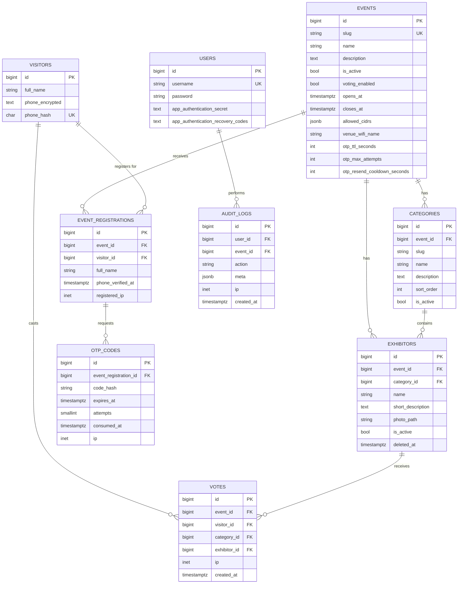

# 02 — Entity Relationship Diagram (ERD)

Digital Voting System (first use: Maker Collective 2026) · Database: Supabase PostgreSQL · Schema owned by Laravel migrations.

> Status: **implemented** in `backend/database/migrations` and running on Supabase (revision 5: Wi-Fi-only on-site rule, at most 3 categories per event, one category per exhibitor). Column types are the actual Postgres types. All timestamps are `timestamptz` (stored in UTC). Every table has `created_at` / `updated_at` except `votes`, `otp_codes` and `audit_logs`, which only have `created_at` because they are never updated.

## 0. Multi-event model (what changed)

The system hosts **many independent voting events**. Each event has its own categories, exhibitors, voting window, on-site rules, visitors' verification state, votes, results, display tokens and admin panel.

- **The phone number is the UID** (normalised E.164, enforced through the HMAC blind index `phone_hash`); visitors enter only full name + phone.
- **Identity is global, verification is per event.** A visitor (one row per phone number) can take part in many events, which keeps the outreach list de-duplicated (F14). But **OTP verification is required again for every new event**: verification lives on `event_registrations`, not on `visitors`.
- **Categories and exhibitors belong to one event** (no shared catalog).
- **At most 3 categories per event, and each exhibitor competes in exactly one category** (decision; the spec's F9 allowed "one or more"). The limit is `voting.max_categories_per_event` (default 3), enforced by the `Category` model and the admin panel.
- **Settings are per event** (columns on `events`), because each event may have a different venue, window and OTP policy.
- **Admins:** one pool of admins; every admin can manage every event (decision). Each event is its own panel in the admin UI.
- The database enforces that categories, exhibitors, registrations and votes of an event can never point at another event's rows (composite foreign keys, §2).

## 1. Diagram

Two relationships are not drawn, to keep the diagram readable, but exist in the schema: `votes.event_id` → `events.id` (every vote belongs to an event; also part of the composite foreign keys in §2) and `audit_logs.event_id` → `events.id` (nullable).

**Delete behaviour:** foreign keys to `events`, `visitors` and `users` are `RESTRICT` (events are archived with `is_active = false`, never deleted once they have data; `audit_logs` is append-only). `exhibitors.category_id` is `RESTRICT`, so a category that still has exhibitors cannot be deleted. `otp_codes` `CASCADE` from their registration. Everything referenced by `votes` is `RESTRICT`.

Framework tables (not drawn): `personal_access_tokens` (Laravel Sanctum — visitor tokens and TV display tokens, both **bound to one event** through their abilities), `sessions`, `cache` / `cache_locks`, `jobs` / `failed_jobs`. Sessions, cache and queues are **database-backed** so the application holds no state in memory or on local disk and any instance can serve any request.

## 2. Tables

### `events`
One row per voting event; also its configuration (F10, F11, spec §6 "database-driven").

| Column | Type | Notes |
|---|---|---|
| `id` | bigint PK | |
| `slug` | varchar UNIQUE | Used in API paths and in the event's QR code, e.g. `mc2026` |
| `name` | varchar | Display name |
| `description` | text null | |
| `is_active` | bool | Inactive events are hidden from the public API (404) and remain visible to admins (archive instead of delete) |
| `voting_enabled` | bool | Manual open/close switch (F10) |
| `opens_at` / `closes_at` | timestamptz null | Optional window. CHECK `closes_at > opens_at` when both set |
| `allowed_cidrs` | jsonb | Array of venue public IP ranges — **IPv4 and IPv6** — e.g. `["203.0.113.0/24", "2001:db8:1::/48"]`. Venue visitors share these addresses (Wi-Fi NAT) |
| `venue_wifi_name` | varchar null | Wi-Fi network name shown on the "No access" page, e.g. `MC2026-Guest` |
| `otp_ttl_seconds` | int default 300 | OTP lifetime |
| `otp_max_attempts` | int default 5 | Wrong-code attempts before the code is invalidated |
| `otp_resend_cooldown_seconds` | int default 60 | Minimum gap between OTP requests |
| `created_at` / `updated_at` | timestamptz | |

Voting is **open** iff `voting_enabled = true` AND (`opens_at` is null or now ≥ `opens_at`) AND (`closes_at` is null or now < `closes_at`). (Planned for the scaling step: read event rows through a short-lived cache to keep the hot path off the database.) Events with registrations or votes cannot be hard-deleted.

### `categories`
The award categories **of one event** (names to be confirmed by the Makerspace team). Nothing is hard-coded. **At most 3 per event** (`voting.max_categories_per_event`; the admin panel disables "New category" at the limit).

| Column | Type | Notes |
|---|---|---|
| `id` | bigint PK | |
| `event_id` | bigint FK → `events.id` | |
| `slug` | varchar | UNIQUE per event: `UNIQUE (event_id, slug)` |
| `name` | varchar | |
| `description` | text null | |
| `sort_order` | int | Display order |
| `is_active` | bool | Inactive categories are hidden and cannot receive votes |

Extra constraint: `UNIQUE (event_id, id)` — target for the same-event composite foreign key on `exhibitors`.

### `exhibitors`
Exhibitors **of one event**, each competing in **exactly one category** of that event (F9).

| Column | Type | Notes |
|---|---|---|
| `id` | bigint PK | |
| `event_id` | bigint FK → `events.id` | |
| `category_id` | bigint | The one category the exhibitor competes in |
| `name` | varchar | |
| `short_description` | text | Shown on the voting card |
| `photo_path` | varchar null | Object key in Supabase Storage (S3-compatible); public URL is built by the API |
| `is_active` | bool | |
| `deleted_at` | timestamptz null | Soft delete (F9 "remove"); hard delete is blocked once votes exist |

Constraints:
- `FOREIGN KEY (event_id, category_id) REFERENCES categories (event_id, id) ON DELETE RESTRICT` — **the category must belong to the exhibitor's own event.**
- `UNIQUE (event_id, category_id, id)` — target for the votes foreign key.

### `visitors` (global)
One row per phone number, shared by all events. Holds identity only — **no verification state**.

**The phone number is the visitor's UID.** There is no username, password or email; the only data a visitor enters is **full name + phone**.
- The phone is normalised to E.164 before anything else (`0791234567` = `+962791234567`), so one person cannot register twice by formatting the number differently. Parsing/validation uses a phone-number library (libphonenumber).
- The UID is *enforced* by `phone_hash` (UNIQUE, HMAC blind index) and is how every lookup is done. The numeric `id` is an internal join key only, so the number is not copied into `votes` / `event_registrations` and rotating the HMAC secret never breaks relations. Neither the phone nor the internal id is exposed in URLs or API responses.
- Honest limit: one phone = one person is an assumption. Someone with several SIMs or virtual numbers could hold several UIDs; OTP delivery and the on-site rule are what make that costly (an optional SMS-provider line-type check can flag VoIP numbers).

| Column | Type | Notes |
|---|---|---|
| `id` | bigint PK | Internal join key |
| `full_name` | varchar | Latest full name given in a *verified* registration (used for the outreach list) |
| `phone_encrypted` | text | E.164 number, encrypted at rest (Laravel `encrypted` cast, app key). Readable in admin context only |
| `phone_hash` | char(64) UNIQUE | HMAC-SHA256 of the E.164 number with a dedicated server secret — the **blind index** used for uniqueness and lookups |
| `created_at` / `updated_at` | timestamptz | |

### `event_registrations` (per-event verification)
A visitor's participation in **one** event. This is where "OTP must be confirmed again for every new event" is enforced: a visitor may vote in an event only if their registration for **that** event has `phone_verified_at` set.

| Column | Type | Notes |
|---|---|---|
| `id` | bigint PK | |
| `event_id` | bigint FK → `events.id` | |
| `visitor_id` | bigint FK → `visitors.id` | |
| `full_name` | varchar | Full name entered for this event (copied to `visitors.full_name` only after verification, so nobody can rename someone else's record by requesting an OTP for their number) |
| `phone_verified_at` | timestamptz null | Set when this event's OTP is verified (F6) |
| `registered_ip` | inet null | Audit |
| `created_at` / `updated_at` | timestamptz | |

Constraint: `UNIQUE (event_id, visitor_id)` (also the target for the votes foreign key).

### `otp_codes`
| Column | Type | Notes |
|---|---|---|
| `id` | bigint PK | |
| `event_registration_id` | bigint FK → `event_registrations.id` ON DELETE CASCADE | OTPs belong to a registration, i.e. to one event |
| `code_hash` | varchar | Hash of the 6-digit code — the plain code is never stored or logged (except by the dev-only log SMS provider) |
| `expires_at` | timestamptz | TTL from `events.otp_ttl_seconds` |
| `attempts` | smallint | Failed verifications; code is invalidated at `events.otp_max_attempts` |
| `consumed_at` | timestamptz null | Single use |
| `ip` | inet null | Requesting IP (rate-limit / audit) |
| `created_at` | timestamptz | |

Index: `(event_registration_id, created_at DESC)` to find the latest active code.

### `votes`
| Column | Type | Notes |
|---|---|---|
| `id` | bigint PK | |
| `event_id` | bigint | |
| `visitor_id` | bigint | |
| `category_id` | bigint | |
| `exhibitor_id` | bigint | |
| `ip` | inet null | Audit |
| `created_at` | timestamptz | |

Constraints and indexes:
- **`UNIQUE (visitor_id, category_id)`** — one vote per verified phone per category (F2, F12). A category belongs to exactly one event, so this is automatically "per event". Enforced by the database, so it holds under concurrency, retries and multiple app instances.
- **`FOREIGN KEY (event_id, category_id, exhibitor_id) REFERENCES exhibitors (event_id, category_id, id) ON DELETE RESTRICT ON UPDATE RESTRICT`** — a vote's category must be the exhibitor's category, in the same event. Consequence: an exhibitor that has votes **cannot be moved to another category** (the admin panel locks the field and says why).
- **`FOREIGN KEY (event_id, visitor_id) REFERENCES event_registrations (event_id, visitor_id) ON DELETE RESTRICT`** — the voter must be registered for that event (that registration must also be verified; checked in the vote transaction).
- Index `(event_id, category_id, exhibitor_id)` — makes tally queries (`COUNT(*) GROUP BY`) cheap.
- Votes are **immutable**: no update path exists. "Reset results" deletes **one event's** votes only (registrations and verification are kept); it is audit-logged and should be preceded by an export.

### `users` (admins)
Makerspace staff only. Visitors are **not** in this table. All admins can manage all events. Admins log in with **username + password** (no email is stored), plus TOTP MFA. Laravel's `remember_token` column also exists.

| Column | Type | Notes |
|---|---|---|
| `id` | bigint PK | |
| `username` | varchar UNIQUE | |
| `password` | varchar | Bcrypt/Argon2 hash |
| `app_authentication_secret` | text null | TOTP secret for the authenticator app, encrypted (Filament MFA) |
| `app_authentication_recovery_codes` | text null | One-time recovery codes, encrypted |

### `audit_logs`
Append-only record of sensitive admin actions: login, event/settings change, voting opened/closed, **results reset**, **exports** (results / visitor list), display-token creation/revocation.

| Column | Type | Notes |
|---|---|---|
| `id` | bigint PK | |
| `user_id` | bigint FK → `users.id` null | |
| `event_id` | bigint FK → `events.id` null | Null for global actions (e.g. login) |
| `action` | varchar | e.g. `votes.reset`, `visitors.export` |
| `meta` | jsonb | Details (old/new values, counts) |
| `ip` | inet null | |
| `created_at` | timestamptz | |

### Tokens (Sanctum `personal_access_tokens`)
- **Visitor token** — owner (`tokenable`) is the **visitor**; issued after OTP verification **for one event**; abilities `["vote", "event:<event_id>"]`. Using it on another event's endpoints is rejected, which forces the OTP flow for that event.
- **Display token** (TV screen) — owner is the **event** itself; created by an admin on the event's **TV displays** page; abilities `["results:read", "event:<event_id>"]`; expires after 1, 7 or 30 days; `last_used_at` shows when the screen was last seen (updated at most once a minute). Revoking deletes the row. Creation and revocation are audit-logged (`display_token.created`, `display_token.revoked`).

## 3. Privacy & security of stored data (F14, Privacy NFR)

- **Phone numbers** are stored encrypted (`phone_encrypted`); uniqueness and login lookups use only the HMAC `phone_hash`, so a database leak alone does not reveal numbers, and the HMAC secret is held outside the database. Admins read the real number through the admin panel (encrypted cast decrypts server-side).
- **Row Level Security is ENABLED on every table with no policies.** Supabase exposes tables through a public PostgREST API using the anon key; with RLS on and no policies, that API returns nothing. Laravel connects with the privileged database role and is the only access path. As defence in depth, the same migration also **revokes all table privileges from Supabase's `anon` and `authenticated` roles**, and a test fails if any table is ever created without RLS.
- **OTP codes** and **tokens** are stored hashed. Sanctum tokens are stored as SHA-256 hashes by default.
- Visitor lists (names + phones) are available **only** in the admin panel and its per-event CSV export, which require admin login + MFA and are audit-logged.
- **Open item:** the registration screen should show a short notice that the name and phone number are stored for future Makerspace outreach (consent wording to be provided by CPF / Makerspace).

## 4. Requirement traceability (data)

| Requirement | Where it lives |
|---|---|
| Multiple events (new) | `events` + `event_id` on categories, exhibitors, registrations, votes |
| OTP re-confirmed per event (new) | `event_registrations.phone_verified_at`, event-bound tokens |
| F1 Exhibitor listing | `exhibitors` (with `category_id`), `categories` |
| F2 One vote per category | `votes` UNIQUE `(visitor_id, category_id)` |
| F3 Already-voted state | `votes` (read by `GET /events/{event}/me`) |
| F5 / F6 Registration + OTP | `visitors`, `event_registrations`, `otp_codes` |
| F9 Exhibitor management | `exhibitors` (one `category_id` each), `photo_path`; max 3 `categories` per event |
| F10 Voting window | `events.voting_enabled / opens_at / closes_at` |
| F11 On-site access control | `events.allowed_cidrs` (venue Wi-Fi only) |
| F12 Duplicate-vote prevention | `votes` UNIQUE + `visitors.phone_hash` UNIQUE + verified registration |
| F13 Results export | aggregate over `votes` per event |
| F14 Visitor data storage | `visitors` (encrypted phone) + `event_registrations`, linked to `votes` |
| Spec §6 "database-driven" | `events`, `categories`, `exhibitors` |
