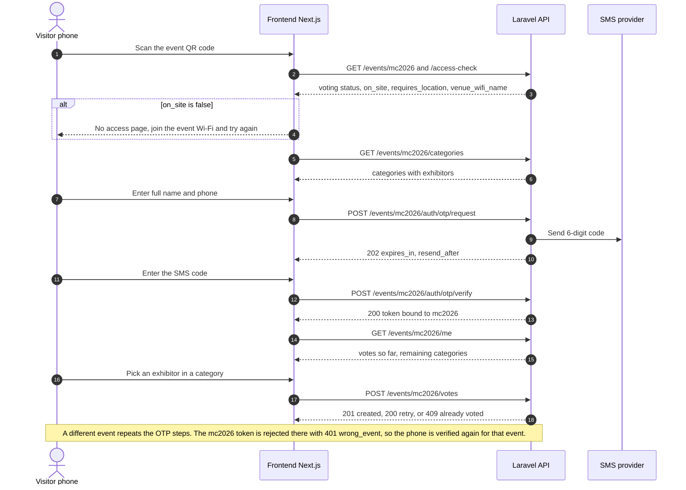

# 03 — API Contract (v1)

Digital Voting System (multi-event; first event: Maker Collective 2026) · Laravel API consumed by the Next.js frontend (visitor voting page + TV results screen).

> Status: revision 3. **Implemented so far:** `GET /events/{event}/access-check`, the on-site gate, the error shape and the IP-aware rate limits. The other endpoints are still to be built and may change slightly; the frontend developer should confirm this covers both screens.
> The admin panel (Filament) is **not** part of this API; it is a separate server-rendered interface.

## 1. Conventions

- **Base path:** `/api/v1` · **Format:** JSON (`Accept: application/json`, `Content-Type: application/json`).
- **Everything is scoped to an event:** `/api/v1/events/{event}/…` where `{event}` is the event **slug** (e.g. `mc2026`). Each event's QR code points the visitor to the frontend page for that slug.
- **Success envelope:** `{ "data": … }`.
- **Auth:** `Authorization: Bearer <token>` (Laravel Sanctum). Two token kinds, **both bound to a single event**:
  - **Visitor token** — issued by `POST /events/{event}/auth/otp/verify`; abilities `vote` + that event. It is **not valid for any other event**.
  - **Display token** — created by an admin for the TV screen of one event; ability `results:read` + that event; read-only and revocable.
- **OTP is per event.** Verifying a phone for Event A does not carry over to Event B: on Event B the visitor goes through `otp/request` → `otp/verify` again and receives a new token for B. The frontend may prefill name/phone from local storage but must still complete the OTP.
- **Timestamps:** ISO-8601 UTC.
- **The phone number is the visitor's UID.** A visitor is identified by their phone number alone: no username, password or email. The only data a visitor enters is **full name + phone**. The phone is normalised server-side to E.164 (`0791234567`, `+962 79 123 4567` and `00962791234567` are the same visitor; default country Jordan, `+962`; invalid numbers are rejected with `VALIDATION_FAILED`). One phone = one visitor = one vote per category. The phone never appears in URLs or API responses.
- **CORS:** only the configured frontend origin(s).
- **Photos:** `photo_url` is an absolute URL (Supabase Storage); may be `null`.
- **Statelessness:** no cookies or server sessions are used by this API; any instance can serve any request.

### Error shape

```json
{ "error": { "code": "OFF_SITE", "message": "Voting is only available at the venue.", "details": {} } }
```

`message` is human-readable and safe to show to visitors; the frontend should branch on `code`.

| HTTP | `code` | When |
|---|---|---|
| 401 | `UNAUTHENTICATED` | Missing/invalid/expired token, **or a token issued for a different event**. `details.reason`: `missing` \| `invalid` \| `expired` \| `wrong_event` — on any of these, send the visitor through the OTP flow for this event |
| 403 | `OFF_SITE` | Request is outside the event's allowed IP range / geofence. `details`: `{ reason, venue_wifi_name }` so the No access page can name the network |
| 403 | `LOCATION_REQUIRED` | The event's mode needs location and `lat`/`lng` were not sent. `details`: `{ reason, venue_wifi_name }` |
| 403 | `VOTING_CLOSED` | Voting is not currently open for this event (`details.status`: `closed` \| `scheduled`) |
| 403 | `UNVERIFIED` | Visitor's registration for this event is not verified (defensive; should not occur with a valid token) |
| 404 | `EVENT_NOT_FOUND` | Unknown or inactive event slug |
| 409 | `ALREADY_VOTED` | Visitor already voted in this category for a *different* exhibitor |
| 422 | `VALIDATION_FAILED` | Field errors in `details.fields` |
| 422 | `INVALID_EXHIBITOR_FOR_CATEGORY` | Exhibitor is not entered in that category of this event (or is inactive) |
| 422 | `OTP_INVALID` | Wrong code (`details.attempts_remaining`) |
| 422 | `OTP_EXPIRED` | Code expired, consumed, or attempts exhausted — request a new one |
| 429 | `OTP_RATE_LIMITED` | Too many OTP requests (`details.retry_after` seconds; also `Retry-After` header) |
| 429 | `TOO_MANY_REQUESTS` | Generic throttle on any other endpoint (`details.retry_after` seconds; also `Retry-After` header) |

### Order of checks (for write endpoints)

All: event lookup (`EVENT_NOT_FOUND`) first.
`OTP request`: validation → on-site gate → voting open → rate limit → send.
`Vote`: authentication (token valid **and bound to this event**) → on-site gate → voting open → validation → business rules → insert.
Keeping the gate before the business rules means off-site clients learn nothing about the system.

## 2. Endpoints at a glance

| Method & path | Auth | On-site gate | Purpose | Req. |
|---|---|---|---|---|
| `GET /events` | none | no | List active events (slug, name, voting status) | — |
| `GET /events/{event}` | none | no | Event name + voting status + window | F10 |
| `GET /events/{event}/access-check` | none | no | Is this device on-site for this event? | F11 |
| `GET /events/{event}/categories` | none | no | Categories with their exhibitors | F1 |
| `POST /events/{event}/auth/otp/request` | none | **yes** | Register full name + phone for this event, send OTP | F5, F6 |
| `POST /events/{event}/auth/otp/verify` | none | **yes** | Verify OTP, receive this event's visitor token | F6 |
| `POST /events/{event}/auth/logout` | visitor | no | Revoke the token | — |
| `GET /events/{event}/me` | visitor | no | Visitor + the categories already voted in | F3 |
| `POST /events/{event}/votes` | visitor | **yes** | Cast one vote in one category | F2, F12 |
| `GET /events/{event}/results` | display token | no | Standings snapshot | F7 |
| `GET /events/{event}/results/stream` | display token | no | Live standings (SSE) | F7, F8 |

**Rate limits (defaults, configurable).** All visitors at the venue share one public IP (Wi-Fi NAT), so **visitor limits must never be keyed on the IP for venue traffic**. They are keyed on the **phone** and the **token**. Per-IP limits apply only to IPs *outside* the event's `allowed_cidrs`, which the on-site gate rejects anyway.

| Scope | Limit |
|---|---|
| `otp/request` | Cooldown per phone per event (`otp_resend_cooldown_seconds`, default 60 s) · 5 per 15 min per phone **across all events** (SMS cost) |
| `otp/verify` | 10 / min per phone · per-code attempt cap (`otp_max_attempts`, default 5) |
| `votes` | 30 / min per token |
| Authenticated reads (`/me`) | 120 / min per token |
| Venue IPs (inside `allowed_cidrs`) | **No per-IP throttle**; only a safety ceiling of 5,000 requests / min per IP to stop a runaway script |
| Off-site IPs (outside `allowed_cidrs`) | 30 / min per IP on every endpoint |

---

## 3. Public endpoints

### `GET /events`

```json
{ "data": [
  { "slug": "mc2026", "name": "Maker Collective 2026", "description": "…",
    "voting": { "status": "open", "opens_at": null, "closes_at": "2026-11-14T18:00:00Z" } }
] }
```
Only active events. Optional — the normal entry point is the event's own QR code.

### `GET /events/{event}`

```json
{ "data": {
    "slug": "mc2026",
    "name": "Maker Collective 2026",
    "voting": { "status": "open", "opens_at": null, "closes_at": "2026-11-14T18:00:00Z" },
    "categories_count": 3,
    "server_time": "2026-11-14T10:32:05Z"
} }
```
`status`: `open` | `closed` | `scheduled`. `server_time` lets the UI show countdowns without trusting the phone's clock.

### `GET /events/{event}/access-check`

Optional query: `lat`, `lng`. Lets the UI show "you're outside the venue" **before** the visitor types anything.

```json
{ "data": { "on_site": false, "mode": "ip", "requires_location": false,
            "reason": "OUTSIDE_IP_RANGE", "venue_wifi_name": "MC2026-Guest" } }
```
`reason` ∈ `null` | `OUTSIDE_IP_RANGE` | `OUTSIDE_GEOFENCE` | `LOCATION_REQUIRED`. `requires_location` tells the frontend whether to ask the browser for geolocation permission (only when the event's mode uses the geofence). `venue_wifi_name` (nullable) is the network name to show on the **No access** page. If `on_site` is `false`, route the visitor to that page (see §7).

### `GET /events/{event}/categories`

Active categories of this event in `sort_order`, each with its active exhibitors.

```json
{ "data": [
  { "id": 1, "slug": "people-choice", "name": "People's Choice", "description": "…",
    "exhibitors": [
      { "id": 12, "name": "Smart Greenhouse", "short_description": "Soil-sensing…", "photo_url": "https://…/12.jpg" }
    ] }
] }
```
Each exhibitor competes in exactly one category, so it appears once. An event has at most 3 categories.

---

## 4. Visitor authentication (per event)

### Visitor flow



### `POST /events/{event}/auth/otp/request` — on-site gate

```json
{ "full_name": "Lina Haddad", "phone": "0791234567", "lat": 31.9539, "lng": 35.9106 }
```
`lat`/`lng` are required only when `requires_location` is true (geofence modes; not needed for the default Wi-Fi-only rule). `full_name`: 2–80 chars, trimmed. `phone`: any common format, normalised to the UID (see §1). No password.

`202`
```json
{ "data": { "expires_in": 300, "resend_after": 60 } }
```
Finds or creates the visitor for that phone, creates/reuses **this event's** registration (unverified), and sends a 6-digit SMS code. This happens even if the phone was verified for a different event — verification is per event. The response is identical whether or not the phone was seen before (no phone enumeration). Errors: `EVENT_NOT_FOUND`, `VALIDATION_FAILED`, `OFF_SITE`, `LOCATION_REQUIRED`, `VOTING_CLOSED`, `OTP_RATE_LIMITED`.

### `POST /events/{event}/auth/otp/verify` — on-site gate

```json
{ "phone": "0791234567", "code": "483920" }
```
`200`
```json
{ "data": { "token": "1|AbC…", "token_type": "Bearer", "expires_at": "2026-11-14T18:00:00Z",
            "visitor": { "full_name": "Lina Haddad" } } }
```
Marks the phone verified **for this event** and returns the visitor token bound to this event (lifetime: 12 h or until the event's `closes_at`, whichever is sooner). The frontend keeps it in memory/`sessionStorage` **per event slug** and sends it as `Authorization: Bearer`. Errors: `EVENT_NOT_FOUND`, `VALIDATION_FAILED`, `OFF_SITE`, `LOCATION_REQUIRED`, `OTP_INVALID`, `OTP_EXPIRED`, `TOO_MANY_REQUESTS`.

### `POST /events/{event}/auth/logout` — visitor token
`204 No Content`. Revokes the current token.

### `GET /events/{event}/me` — visitor token

```json
{ "data": {
    "visitor": { "full_name": "Lina Haddad" },
    "votes": [ { "category_id": 1, "exhibitor_id": 12, "voted_at": "2026-11-14T10:41:00Z" } ],
    "remaining_category_ids": [2, 3]
} }
```
Source of truth for "which categories have I already voted in" (F3) **for this event**. Call it after login and after any network error during voting. A token from another event returns `401 UNAUTHENTICATED` with `details.reason = "wrong_event"`.

---

## 5. Voting

### `POST /events/{event}/votes` — visitor token, on-site gate

```json
{ "category_id": 1, "exhibitor_id": 12, "lat": 31.9539, "lng": 35.9106 }
```

| Result | HTTP | Meaning |
|---|---|---|
| Created | `201` | Vote recorded. Body: `{ "data": { "category_id": 1, "exhibitor_id": 12, "voted_at": "…", "remaining_category_ids": [2,3] } }` |
| Same vote repeated | `200` | **Idempotent retry**: the same visitor re-sent the same vote (e.g. response lost to a network drop). Same body as `201`; nothing is counted twice |
| Different exhibitor, same category | `409 ALREADY_VOTED` | Votes cannot be changed. `details`: `{ category_id, exhibitor_id }` = the vote already held |
| Not in that category / other event's category | `422 INVALID_EXHIBITOR_FOR_CATEGORY` | |
| Closed / off-site / no token / token of another event | `403 VOTING_CLOSED` / `403 OFF_SITE` / `401 UNAUTHENTICATED` | |

Safe to retry on any network failure: the database `UNIQUE (visitor_id, category_id)` guarantees at most one counted vote per category even under concurrent requests.

---

## 6. Results (TV screen)

Both results endpoints require a **display token for this event** (or an equivalent admin-created token); they are not available to visitors.

### `GET /events/{event}/results`

```json
{ "data": {
    "event": { "slug": "mc2026", "name": "Maker Collective 2026" },
    "generated_at": "2026-11-14T10:45:02Z",
    "total_voters": 412,
    "total_votes": 1190,
    "categories": [
      { "id": 1, "name": "People's Choice", "total_votes": 398,
        "standings": [
          { "rank": 1, "exhibitor_id": 12, "name": "Smart Greenhouse", "photo_url": "https://…/12.jpg", "votes": 91 },
          { "rank": 2, "exhibitor_id": 7,  "name": "Robo Arm",         "photo_url": null,                "votes": 78 }
        ] }
    ]
} }
```
Ties share a rank (1, 1, 3). Every active exhibitor appears, including those with 0 votes. `total_voters` = distinct visitors who cast at least one vote in this event. The tally query is cached ≈ 1 s server-side.

### `GET /events/{event}/results/stream` (Server-Sent Events)

`Content-Type: text/event-stream`. Auth: `?token=<display token>` — the browser `EventSource` API cannot set headers. (A `fetch`-based SSE client may send the `Authorization` header instead.) The display token is read-only, scoped to `results:read` for this event, revocable, and stripped from access logs.

```
retry: 3000

event: snapshot
data: {"event":{…},"generated_at":"…","total_voters":412,"total_votes":1190,"categories":[…]}

: heartbeat
```
- A full `snapshot` (same JSON as `GET …/results` `data`) is sent immediately on connect, then again whenever tallies change (checked about every 2 s).
- A `: heartbeat` comment is sent every ≈ 15 s to keep proxies from closing the connection.
- The browser reconnects automatically after drops (`retry: 3000`); because every message is a **full snapshot**, a reconnect needs no catch-up logic.
- **Fallback:** if SSE is unavailable, poll `GET …/results` every 2–3 s.
- `401 UNAUTHENTICATED` is returned for a missing/revoked/wrong-event token — the screen should show "display token invalid".

---

## 7. On-site access control (F11) — per event

Decided **server-side** from the event's database settings (`access_mode`, `allowed_cidrs`, `geofence`) on `otp/request`, `otp/verify` and `votes`. Each event can have its own venue and rules.

### MC2026 default — venue Wi-Fi only (strict)

Voting happens only at the venue, and the venue provides Wi-Fi covering the whole event area, so the rule for MC2026 is **venue Wi-Fi only**: the check is **the venue Wi-Fi's public IP address(es)**. This is the strictest option: it cannot be faked from a phone, so it is the fairest against remote voting.

- **Trade-off, stated honestly:** a visitor who cannot join the Wi-Fi (overloaded network, VPN, Private Relay, phone problem) cannot vote. Mitigations: venue Wi-Fi sized for 1,000+ clients, signage with the network name, clear troubleshooting steps on the No access page, and — because the mode is a per-event database setting — the Makerspace can relax it **live** from the admin panel (e.g. to `either`) if Wi-Fi problems appear on the day.
- `access_mode = ip`; geofence off; `allowed_cidrs` = the Wi-Fi's public egress ranges, **IPv4 and IPv6** if the guest network has IPv6. Every visitor behind the Wi-Fi's NAT shares these addresses, so one range check admits all of them and nobody else.
- Unlike GPS, a client cannot forge its public IP, so this is the strong signal. The geofence is an **optional backup** (`either` mode) for when the venue cannot guarantee a stable IP.
- If the API runs on a server **inside** the venue network, visitors have private LAN addresses; put the LAN range in `allowed_cidrs` instead. Same mechanism.

| `access_mode` | Passes when |
|---|---|
| `ip` | Client IP is inside one of `allowed_cidrs` |
| `geo` | `lat`/`lng` fall inside the geofence radius |
| `either` | IP matches **or** geofence matches |
| `both` | IP matches **and** geofence matches |

### Off-site visitors: the "No access" page

1. On load the frontend calls `GET …/access-check`.
2. If `on_site` is `false`, route to a **No access** page: *"Voting is only available on the event Wi-Fi. Connect to **{venue_wifi_name}**, turn off any VPN, and try again"*, with a **Try again** button that calls `access-check` again. `reason` can fine-tune the text.
3. This redirect is UX only. The API re-checks on every write endpoint and returns `403 OFF_SITE`, so skipping the redirect gains nothing. Public read endpoints stay open.

### The API must see the visitor's real IP (critical)

- The browser must call the Laravel API **directly**. Do **not** call it from Next.js server code (server actions, route handlers, SSR fetches) on behalf of a visitor: the API would then see the Next.js server's IP, not the visitor's.
- If a reverse proxy, CDN or load balancer sits in front of the API, register it as a **trusted proxy**. The forwarded-for header is honoured only when it comes from a trusted proxy, never from a client.

### Known failure modes

| Situation | Effect | Mitigation |
|---|---|---|
| Visitor on mobile data | Seen as off-site | No access page tells them to join the event Wi-Fi |
| iPhone Private Relay or a VPN is on | Venue IP is hidden, visitor is blocked | Ask the venue to block Private Relay on the guest network; No access page mentions turning off VPN / Private Relay |
| IPv6 | Phone reaches the API from an IPv6 address that is not in the list | Get the venue's IPv6 prefix too, or disable IPv6 on the guest SSID |
| Two internet lines / failover | Public IP changes mid-event | Allowlist every egress range; admin can edit it live |
| IP changes on the day | Everyone is blocked | Admin panel **"Use my current IP"** button; rehearse before the event |
| Geofence (if enabled) | Location is client-supplied and spoofable | Backup only; never the sole check unless IP is unavailable |

### What can and cannot fool the on-site check

- **The Wi-Fi name is never checked.** A browser cannot read which network a phone is on, and the API does not ask. `venue_wifi_name` is display text only, so a fake hotspot with the same name gains nothing: its traffic leaves through the attacker's own internet line, with a non-venue IP, and is rejected with `OFF_SITE`.
- **The source IP cannot be forged.** Requests run over TCP and HTTPS, so a forged source address never gets a response back.
- **A fake `X-Forwarded-For` header is ignored.** The header is only honoured from proxies listed in `TRUSTED_PROXIES`; from a client it has no effect (covered by an automated test).
- **Residual risk: relaying through someone at the venue.** An accomplice on the real Wi-Fi could run a VPN or tunnel so that remote friends' traffic leaves through the venue IP. This takes deliberate setup, and every remote voter still needs their own phone number and OTP, so it does not scale cheaply. Mitigation: ask the venue to enable client isolation and block VPN protocols on the guest network.
- **A hotspot inside the venue that uplinks to the real Wi-Fi** passes, but its users are physically on-site, so it is not remote voting. Their API traffic stays HTTPS-encrypted.

### Setup and rehearsal checklist

1. Ask the venue / CPF network team: public IPv4 and IPv6 egress addresses (static? one line or two?), any captive portal or proxy that rewrites client IPs, capacity for 1,000+ simultaneous clients, and whether Apple Private Relay can be blocked on the guest network.
2. Enter the ranges in the event's admin panel (or use **Use my current IP** while on the venue Wi-Fi).
3. On the venue Wi-Fi: `access-check` must return `on_site: true`. Switch to mobile data: it must return `false` and the No access page must appear. Test on an iPhone and an Android phone.

---

## 8. Admin-only functions (not in this API)

Available only in the Filament admin panel (username + password + TOTP MFA). **Each event is its own panel** (event switcher; panel URL contains the event slug) and all admins can open every event's panel. Per event: category/exhibitor CRUD and assignment, photo upload, voting open/close and window, on-site settings and OTP policy, results reset, results CSV export (F13), visitor list CSV export (F14), display-token creation/revocation, a **"Use my current IP"** helper that adds the admin's current public IP to `allowed_cidrs` (for setup and event-day fixes), audit log. Global: create/archive events, manage admins.

## 9. Requirement traceability (API)

| Req. | Covered by |
|---|---|
| Multiple events | `/events/{event}/…` paths; event-bound tokens; per-event panel |
| OTP re-confirmed per event | `otp/request` + `otp/verify` per event; `wrong_event` → 401 |
| F1 | `GET …/categories` |
| F2 | `POST …/votes` (one per category, DB-enforced) |
| F3 | `201` response + `GET …/me` |
| F4 | Small JSON payloads, CORS for the Next.js app (UI is the frontend's) |
| F5 | `POST …/auth/otp/request` — full name + phone only (phone = UID), no password |
| F6 | `POST …/auth/otp/verify` — token required for `POST …/votes` |
| F7 | `GET …/results`, `GET …/results/stream` |
| F8 | Stream payload carries ranks/totals sized for display (layout is the frontend's) |
| F9 | Admin panel |
| F10 | `GET /events/{event}` status; control in admin panel; enforced on write endpoints |
| F11 | On-site gate + `GET …/access-check` |
| F12 | Verified registration + DB UNIQUE + `409 ALREADY_VOTED` |
| F13 | Admin panel CSV export |
| F14 | `visitors` encrypted phone linked to `votes`; admin-only |
