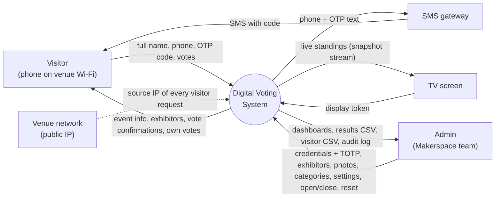

# 04 — Data Flow Diagrams (DFD)

How data enters, moves through and leaves the system. Notation: rectangles = external entities, rounded boxes = processes, cylinders = data stores, dashed boxes = trust boundaries. Table names refer to [02 ERD](02-erd.md).

## Level 0 — Context

## Level 1 — Processes and data stores

```mermaid
flowchart TB
  V["Visitor"]
  T["TV screen"]
  A["Admin"]
  G["SMS gateway"]

  subgraph Public["Trust boundary: public internet → API"]
    P1("P1 Check on-site<br/>(access-check, gate)")
    P2("P2 Register + send OTP")
    P3("P3 Verify OTP,<br/>issue visitor token")
    P4("P4 Cast vote")
    P5("P5 List event,<br/>categories, exhibitors")
    P6("P6 Compute standings")
  end

  subgraph AdminB["Trust boundary: admin panel (session + MFA)"]
    P7("P7 Manage event,<br/>categories, exhibitors, settings")
    P8("P8 Open/close, reset,<br/>export, TV tokens")
  end

  D1[("D1 events · categories · exhibitors<br/>(incl. allowed_cidrs, OTP policy)")]
  D2[("D2 visitors · event_registrations<br/>(phone encrypted + HMAC)")]
  D3[("D3 otp_codes<br/>(code HMAC only)")]
  D4[("D4 votes")]
  D5[("D5 personal_access_tokens<br/>(SHA-256 hashes)")]
  D6[("D6 audit_logs")]
  D7[("D7 photos<br/>(object storage)")]

  V -- "request IP" --> P1
  P1 -- "read allowed_cidrs" --> D1
  P1 -- "on_site + Wi-Fi name" --> V

  V -- "full name, phone" --> P2
  P2 -- "gate passed?" --> P1
  P2 -- "upsert visitor by phone HMAC;<br/>registration for this event" --> D2
  P2 -- "store code HMAC, expiry" --> D3
  P2 -- "phone + code" --> G
  G -- "SMS" --> V

  V -- "phone, code" --> P3
  P3 -- "gate passed?" --> P1
  P3 -- "row-locked check, attempts++" --> D3
  P3 -- "mark registration verified" --> D2
  P3 -- "token hash (abilities vote + event)" --> D5
  P3 -- "token" --> V

  V -- "token, category, exhibitor" --> P4
  P4 -- "token lookup" --> D5
  P4 -- "gate passed?" --> P1
  P4 -- "window, category/exhibitor valid?" --> D1
  P4 -- "INSERT (UNIQUE per category)" --> D4
  P4 -- "confirmation + remaining categories" --> V

  V -- "slug" --> P5
  P5 -- "read" --> D1
  P5 -- "photo URLs" --> D7
  P5 -- "event, exhibitors" --> V

  T -- "display token" --> P6
  P6 -- "token lookup" --> D5
  P6 -- "group & count" --> D4
  P6 -- "names, photos" --> D1
  P6 -- "snapshot stream" --> T

  A -- "CRUD, photos, settings" --> P7
  P7 -- "write" --> D1
  P7 -- "upload" --> D7
  P7 -- "settings changes" --> D6

  A -- "open/close, reset, export, tokens" --> P8
  P8 -- "voting_enabled" --> D1
  P8 -- "delete event votes (reset)" --> D4
  P8 -- "read names, decrypted phones (export)" --> D2
  P8 -- "create / revoke display token" --> D5
  P8 -- "every action" --> D6
  P8 -- "CSV files, live results" --> A
  P6 -- "standings" --> P8
```

## Where personal data flows (F14, Privacy NFR)

| Data | Enters at | Stored as | Leaves the system only via |
|---|---|---|---|
| Full name | P2 (`otp/request`) | Plain text in `event_registrations.full_name` (per event) | `GET …/me` to the same visitor (own name); admin visitor CSV export (audited) |
| Phone number | P2, P3 | `visitors.phone_encrypted` (AES-256 via Laravel encryption, key `APP_KEY`) + `visitors.phone_hash` (HMAC-SHA256, key `PHONE_HASH_KEY`) | SMS gateway (to deliver the code); admin visitor CSV export (audited). **Never** in API responses or URLs. Exception: the development-only `log` SMS driver writes phone + code to `storage/logs/sms.log`; production uses the gateway driver |
| OTP code | Generated in P2 | Only an HMAC in `otp_codes` | SMS to the visitor |
| Visitor / display tokens | Generated in P3 / P8 | Only a SHA-256 hash | Returned once to the visitor / shown once to the admin |
| Client IP | Every request | `event_registrations.registered_ip`, `votes.ip`, `audit_logs.ip` (forensics) | Admin panel only |
| Votes | P4 | `votes` (immutable; reset deletes an event's votes and is audited) | Aggregated counts only (P6, results CSV); per-visitor votes only to the visitor themself (`/me`) |

Supabase's public data API (PostgREST with the `anon` key) is closed: RLS is enabled on every table with no policies and the `anon` / `authenticated` roles have no table privileges, so the only path to the data is through the Laravel processes above.
