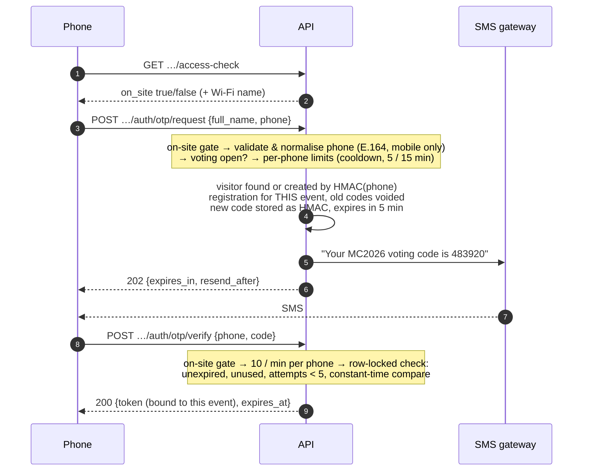

# 05 — Authentication, Authorization & Anti-Fraud

This document explains who can do what, how each actor proves who they are, and how the system stops the ways people might try to cheat. It covers rubric criterion **Access Control & Anti-Fraud** and requirements F5, F6, F10, F11, F12, F14.

## 1. Actors and how they authenticate

| Actor | Proves identity with | Credential issued | Lifetime | Stored server-side as |
|---|---|---|---|---|
| **Visitor** | Full name + mobile number, then a **6-digit SMS code** (F5, F6). No password. | Sanctum bearer token, abilities `vote` + `event:<id>` | 12 h, or until the event's `closes_at` if sooner | SHA-256 hash of the token |
| **TV screen** | Display token created by an admin | Sanctum bearer token owned by the event, abilities `results:read` + `event:<id>` | 1, 7 or 30 days (admin's choice); revocable | SHA-256 hash |
| **Admin** | Username + password + **TOTP code** (authenticator app). MFA is **required**; recovery codes are offered at setup | Server session (cookie) in the admin panel only | Session lifetime 120 min of inactivity | Bcrypt password, TOTP secret, bcrypt-hashed recovery codes; sessions in Postgres. **Open item:** encrypt the TOTP secret at rest (§7) |
| **Supabase public API** (`anon` / `authenticated` keys) | — | — | — | **No access at all**: RLS enabled with no policies on every table, table privileges revoked |

### Visitor sign-in (per event)

- **Per event:** verifying a phone for one event does not carry over to another. A token used on another event's endpoints returns `401 wrong_event`, which sends the visitor through OTP again for that event.
- **The phone number is the visitor's identity (UID).** It is normalised to E.164 with libphonenumber (default country Jordan), so `0791234567`, `+962 79 123 4567` and `00962791234567` are the same person. Landlines and invalid numbers are rejected.
- **No account enumeration:** `otp/request` answers the same whether the phone is new or known; `otp/verify` for a phone that never requested a code answers `OTP_EXPIRED`, like an expired code.
- **Names cannot be hijacked:** once a registration is verified, requesting a new code with a different name does not change the stored name.

### Admin sign-in

Username + password on Filament's login page (5 attempts per minute, then throttled), then the TOTP step. MFA cannot be skipped: an admin without an authenticator app is forced to set one up first. Successful and failed sign-ins go to the audit log. The first admin is created by a seeder that prints a random 20-character password once.

## 2. Authorization matrix

| Operation | Anonymous (any network) | Anonymous on venue Wi-Fi | Visitor token (this event) | Visitor token (other event) | Display token (this event) | Admin |
|---|---|---|---|---|---|---|
| List events, event details, categories & exhibitors | ✅ | ✅ | ✅ | ✅ | ✅ | ✅ |
| `access-check` | ✅ | ✅ | ✅ | ✅ | ✅ | ✅ |
| Request / verify OTP | ❌ `OFF_SITE` | ✅ | — | — | — | — |
| See own votes (`/me`), log out | ❌ | ❌ | ✅ | ❌ `wrong_event` | ❌ | — |
| Cast a vote | ❌ | ❌ | ✅ **only on venue Wi-Fi, only while voting is open** | ❌ | ❌ | ❌ (no admin vote path) |
| Live results / stream | ❌ | ❌ | ❌ | ❌ | ✅ (any network) | ✅ (dashboard widget) |
| Manage categories, exhibitors, photos, settings | ❌ | ❌ | ❌ | ❌ | ❌ | ✅ |
| Open / close voting, reset results, exports, TV tokens, audit log | ❌ | ❌ | ❌ | ❌ | ❌ | ✅ (audited) |

Every admin sees every event (decided with the Makerspace team); each event is its own panel (tenant), and every query in a panel is scoped to that event.

## 3. On-site access control (F11)

**Rule: venue Wi-Fi only.** Each event stores the venue's public IP ranges (`allowed_cidrs`, IPv4 and IPv6). OTP request, OTP verify and vote are rejected with `403 OFF_SITE` unless the request's source IP is inside them. Everyone on the venue Wi-Fi shares the venue's public IP (NAT), so one range admits all of them and nobody else.

- **Why IP and not GPS:** a location is reported by the phone and can be faked with developer tools; a public IP cannot be forged over TCP/HTTPS. GPS also needs a permission prompt that confuses visitors. The geofence option was removed on purpose ([06](06-design-decisions.md) D6).
- **The Wi-Fi name is never checked.** A browser cannot read it. A fake hotspot with the same name sends traffic out through the attacker's own internet line, so it fails the IP check.
- **`X-Forwarded-For` is honoured only from `TRUSTED_PROXIES`** (our own load balancer). A client sending a fake header is ignored (tested).
- **The gate runs before anything else** on OTP endpoints, so off-site clients cannot even trigger an SMS.
- **The redirect to the "No access" page is UX only**; the API re-checks every write.
- **Operational controls:** admins can add ranges live ("Use my current IP" button), e.g. if the venue fails over to a backup line.
- **Residual risk, stated honestly:** someone on the real Wi-Fi could tunnel remote friends' traffic through the venue. It needs deliberate setup and each remote voter still needs their own phone number and OTP. Mitigation: ask the venue for client isolation and blocked VPN protocols on the guest network.

Full details, failure modes and the rehearsal checklist: [03 API contract](03-api-contract.md) §7.

## 4. Duplicate-vote prevention (F12) and vote integrity

Layered, from friendly to absolute:

1. **One verified phone = one visitor.** The phone's HMAC is unique in `visitors`; OTP proves possession of the phone.
2. **Application check:** the category must be active in this event and the exhibitor active in that category.
3. **Database constraints (cannot be bypassed by any code path or race):**
   - `UNIQUE (visitor_id, category_id)` on `votes` → at most one vote per category per visitor.
   - Composite foreign key `votes (event_id, category_id, exhibitor_id) → exhibitors (event_id, category_id, id)` → the exhibitor really is in that category of that event.
   - Foreign keys with `ON DELETE/UPDATE RESTRICT` → an exhibitor with votes cannot be deleted or moved to another category (it is soft-deleted instead, and its votes still count).
4. **Votes are immutable.** The model refuses updates and there is no update or delete endpoint. The only way to remove votes is the admin **Reset results** action, which requires voting to be closed, requires typing the event slug, and is audit-logged.
5. **Safe retries.** If a phone resends the same vote after a network drop, the API answers `200` with the original vote (no double count); a different choice answers `409 ALREADY_VOTED`.

## 5. Threats and controls

| Threat | Control | Where (code / test) |
|---|---|---|
| Voting from outside the venue | IP allowlist gate on OTP + vote; trusted-proxy-only forwarding | `EnsureOnSite`, `VenueAccess` · `OnSiteHttpTest`, `VenueAccessTest` |
| Spoofed `X-Forwarded-For` | Header ignored unless from `TRUSTED_PROXIES` | `AppServiceProvider` · `OnSiteHttpTest` |
| Voting twice in a category | DB `UNIQUE`, immutable votes | migrations · `SchemaConstraintsTest`, `VoteTest` |
| Many fake identities | One identity per real mobile number; OTP required; only mobile numbers accepted | `PhoneNumber`, `OtpService` · `PhoneNumberTest`, `OtpFlowTest` |
| Guessing an OTP | 6 digits, 5-minute expiry, 5 attempts per code, 10 verifications per minute per phone, row-locked check, constant-time compare | `OtpService` · `OtpFlowTest` |
| SMS flooding / SMS cost abuse ("SMS pumping") | Gate first (only the venue can trigger SMS), 60 s cooldown, 5 codes per 15 min per phone across all events, mobile numbers only | `OtpService` · `OtpFlowTest` |
| Stolen visitor token | Token bound to one event, expires (≤ 12 h), stored hashed, only usable from venue Wi-Fi to vote, revoked on logout | `EnsureVisitorToken` · `VoteTest` |
| Using a visitor token on the TV API or vice versa | Owner type and ability checked on each side | `EnsureDisplayToken` · `ResultsApiTest` |
| Leaked TV token | Read-only, one event, expiring, revocable in one click (stream stops within seconds) | `DisplayTokens` page · `ResultsApiTest`, `DisplayTokensAdminTest` |
| Admin account takeover | Required TOTP MFA, login throttling, audit of logins and failures | Filament panel · `AdminPanelTest`, `ResultsAdminTest` |
| Database leak | Phones encrypted (AES-256-CBC + MAC) with a blind-index HMAC under a separate key; OTP codes and tokens only hashed | `Visitor` model, `PhoneNumber` |
| Reading data through Supabase's public API | RLS on every table with no policies; `anon`/`authenticated` privileges revoked; a test fails if a table lacks RLS | migration `…000010` · `RowLevelSecurityTest` |
| Malicious spreadsheet formulas in exports (names like `=HYPERLINK(...)`) | Cells starting with `= + - @` are neutralised | `Csv::cell` · `ResultsAdminTest` |
| Changing or deleting votes quietly | No update path; reset needs closed voting + typed confirmation; every sensitive admin action audited (append-only log) | `Dashboard`, `AuditLog` · `ResultsAdminTest` |
| Request floods | Per-token and per-phone limits; off-site IPs 30/min; venue IP high ceiling only (so the shared venue IP never blocks real visitors) | `AppServiceProvider` rate limiters · `PublicReadTest`, `VoteTest` |

## 6. Visitor data protection (F14, Privacy NFR)

- Name and phone are stored for future Makerspace outreach, linked to the visitor's votes; only admins can read them, through the panel and the audited visitor CSV export (the export warns the admin that it contains personal data).
- Keys live outside the database: `APP_KEY` (encryption, OTP HMAC) and `PHONE_HASH_KEY` (phone blind index). Losing `PHONE_HASH_KEY` means existing visitors can no longer be found by phone, so it must be backed up.
- Open item for CPF: the consent sentence shown on the registration screen ("your name and number are stored for future Makerspace events").

## 7. Known gaps and planned fixes

| Gap | Risk | Planned fix |
|---|---|---|
| Admin TOTP secret is stored unencrypted in `users.app_authentication_secret` | Someone with a database dump could generate an admin's MFA codes (they would still need the password) | Add the `encrypted` cast for the secret and recovery codes, with a migration that encrypts existing values |
| CORS allows any origin (framework default) | Low: the API uses bearer tokens, not cookies, so other sites cannot act as a visitor; but the contract promises a frontend-only origin | Publish `config/cors.php` and restrict to the frontend URL(s) from an env variable |
| SMS is sent inside the request | A slow gateway slows `otp/request` | Move sending to the queue (database queue already configured) once the gateway is chosen |
